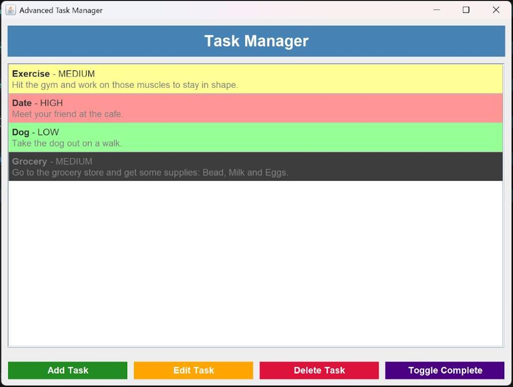

# Task Manager

A clean, desktop-based task management application built in Java that visualizes and tracks daily operations using a color-coded priority tier system.

## Overview

**Task Manager** is a graphical user interface (GUI) application designed to streamline personal organization. Built using Java's Swing framework, it enables users to seamlessly perform CRUD operations on their daily tasks. The interface features a rigid color-coded system that updates item styles dynamically based on priority levels, complete with an offline binary persistence layer that tracks states continuously across execution sessions.

## Features

- **Visual Priority Styling:** Dynamically scales task rows into distinct background themes based on assignment variables (e.g., Pink/Red for **HIGH**, Yellow for **MEDIUM**, and Green for **LOW**).
- **Comprehensive CRUD Engine:** Provides full interface handling to cleanly add, edit, or delete existing task objects via intuitive console button parameters.
- **Toggle Completion State:** Includes specialized line-through visual transitions and background darkening indicators when tasks are marked complete (e.g., _Grocery_ log).
- **Robust Persistence Layer:** Integrates a flat binary data storage strategy (`tasks.dat`) to automatically serialize task states during shutdown and load them cleanly at initial execution startup.

## Screenshots



_Figure 1: Active game loop demonstrating falling circle elements and the color target tracking system._

## Tech Stack

- **Language:** Java (JDK 8 or higher)
- **GUI Framework:** Java Swing / AWT
- **Data Serialization:** Native Java Object Input/Output Streams

## Project Structure

```bash
task-manager/
├── src/                   # Main development source tree repository
│   └── TaskManagerApp.java # Core application logic containing GUI construction and engine loops
├── .gitignore             # Git filtration parameters targeting local metadata caches
├── TaskManagerApp.imL     # IntelliJ modular layout configuration file
└── tasks.dat              # Local binary data repository storing active serialized tasks
```

## Setup & Execution

### Prerequisites

- Java Development Kit (JDK) 8 or higher configured within your path variables.
- An environment supporting standard desktop graphical window engines.

### Installation

- Clone the codebase package cleanly onto your destination terminal environment:

  ```bash
  git clone https://github.com
  ```

- Launch your target terminal inside the `src` folder structure and compile the raw java controller code:

  ```bash
  javac TaskManagerApp.java
  ```

- Execute the compiled bytecode file structure to launch the application window layout:
  ```bash
  java TaskManagerApp
  ```

## Author

H2SO4-1191 – Software Engineer
